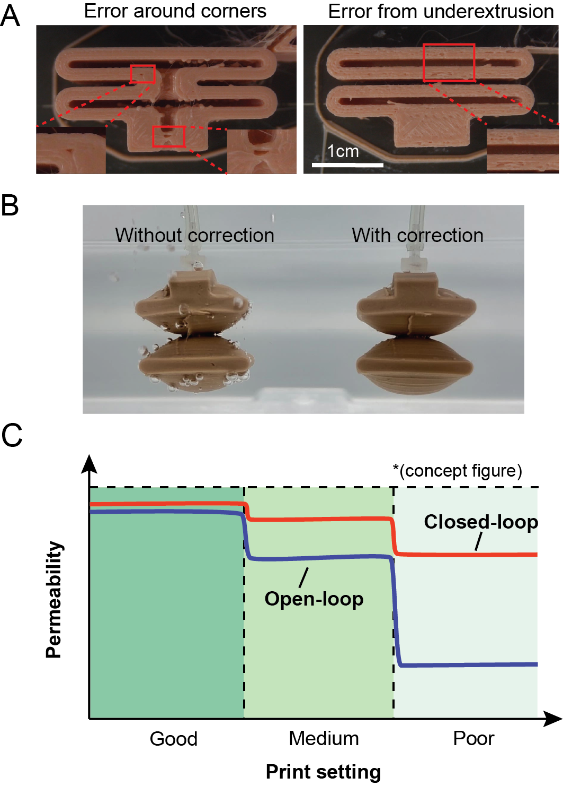
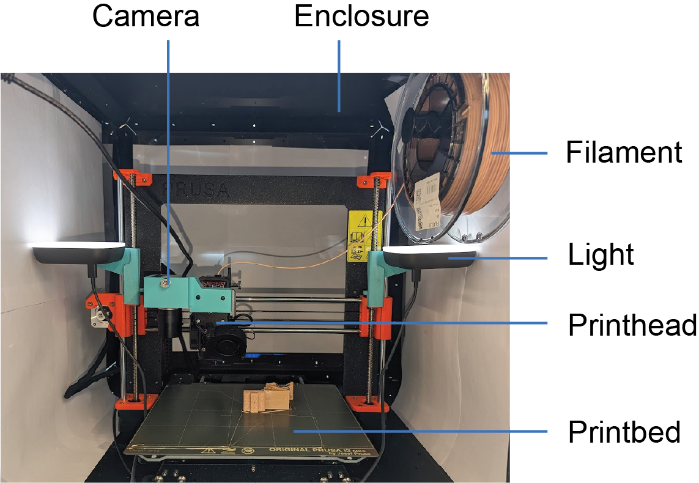
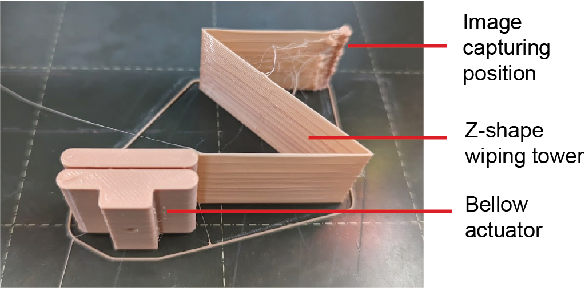

# Vision-based FDM Printing System

tl,dr: This project presents a FDM 3D printing workflow with integrated real-time defect detection and correction capabilities.

This system propose a low-cost approach to improve the print quality of desktop fused deposition modeling by adding a webcam to the printer to monitor the printing process and detect and correct defects such as holes or gaps. This approach improves
the air-tightness of printed pneumatic structures without extensive finetuning printing parameters.

## Requirements
* python 3.11
* pyserial 3.5
* opencv  4.7.0

## User Manual
* Download this repository
* Put parsed G-code files into a self-contained directory named "gcode"
    * Two gcode files are required for running this code, one parsed with z-wipping pattern, one without
* Create directories for storing layerwise parsed g_code files, images, and log files
* Connect to the 3D printer, make sure the port number in correct in "gcode_sender.py"
* Run "iron_detect_and_correct.py"